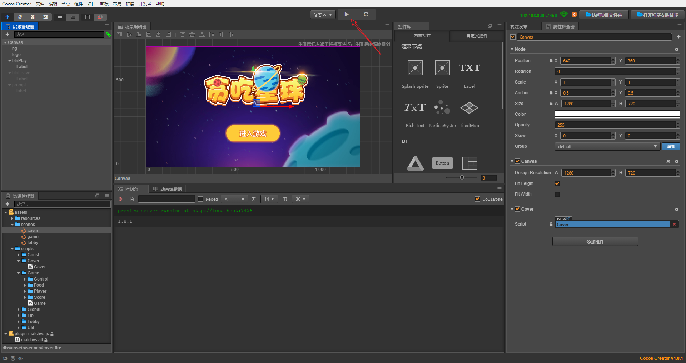
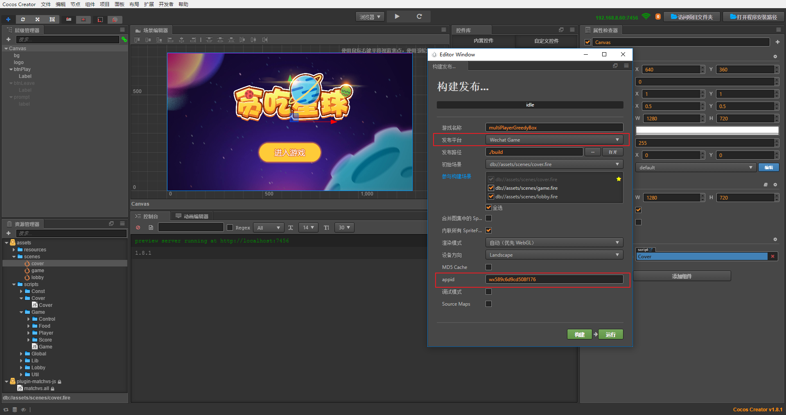
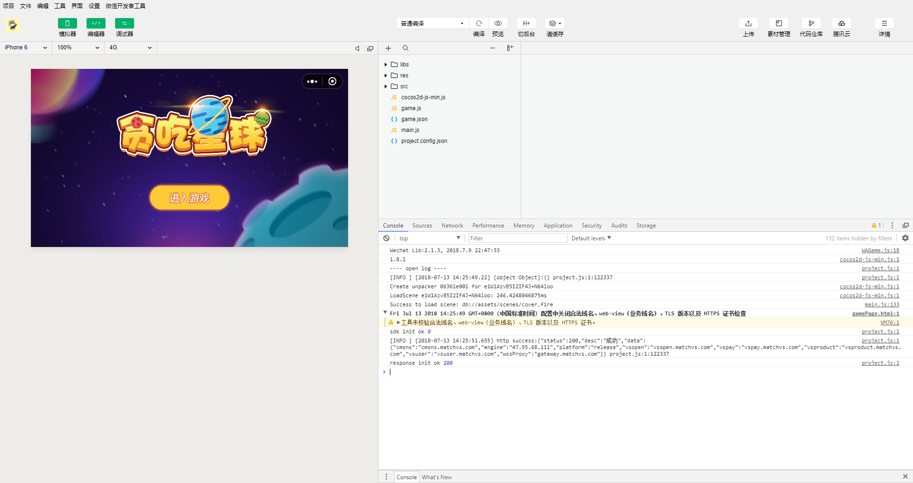
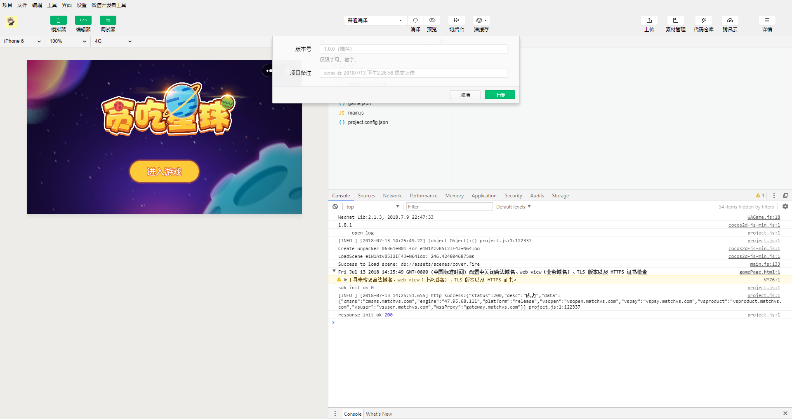

# GreedyStar
## CC游戏案例之 贪吃星球

###  游戏指引
- 本游戏只支持多人玩法。
- 随机加入的房间，房间人数为3人时，即可开始游戏。
- 其他方式加入的房间，房间人数大于等于4人时，房主可点击开始游戏。
- 注意：随机加入和其他方式加入的玩家，是不会匹配到一起的。两者进入的房间，不是同一个“空间”。
- 注意：不同的玩家需要用不同的设备或软件。例如：在游览器运行时，需要用不同的游览器打开不同的游戏实例。

###  玩法说明
- 玩家在游戏中的表现为一个球体（以下简称为球），球在不断移动中，通过不断接触地图元素（元素为地图生成）不断积累分数变大.
- 在接触到其他玩家的球之后，以分数大小为胜负判定，胜者将吃掉负者的球，分数直接做加法累积，负者死亡，倒计时三秒后复活。
- 复活三秒过程中，是无敌的，不能被其他玩家的球吃掉。
- 需要注意的是，如果一个玩家复活出现在另一个玩家的球体所在范围内，是不会检测是否被吃的，这样做是为了保护复活出生的球。
- 游戏过程中可以通过点击加速按钮来获得加速能力，当按下加速按钮立即消耗1金币，之后每1秒消耗0.5金币，直到松开加速按钮。

### 体验地址
微信小游戏体验地址: 

# client

## 环境准备

1. 下载安装[cocos creator](http://www.cocos.com/download)v1.8.1或以上版本
2. 可以不更新本项目使用的matchvs插件,如果想需要使用最新的插件,可以在cocos creator中下载插件,
对应的[教程](http://www.matchvs.com/service?page=creatorStart)

## 下载游戏

1. git clone https://github.com/matchvs/GreedyStar.git
2. 用cocos creator打开该项目GreedyStar下的client文件

## 运行游戏

###  web版体验

1. 打开之后,出现以下界面

2. 点击中上方的三角形按钮,即可运行游戏
3. 就可以愉快的玩耍了 

###  微信版体验

1. 在cocos creator打包输出微信小游戏项目,点击cocos creator上的导航栏中的项目
2. 在构建发布界面中,发布平台为"Wechat Game",填入appid(如果是你自己的项目,你需要在微信开发者平台中申请).

3. 点击构建,之后发布.
4. 用微信开发者工具打开.

5. 当我们写好的代码,我们发布到微信小游戏平台中

5. 就可以愉快的玩耍了

# server

server是使用了matchvs的gameServer,无须自己购买服务器,一键发布上线.

- [参考文档1](http://www.matchvs.com/service?page=jsGsStart)
- [参考文档2](http://www.matchvs.com/service?page=gameServer)